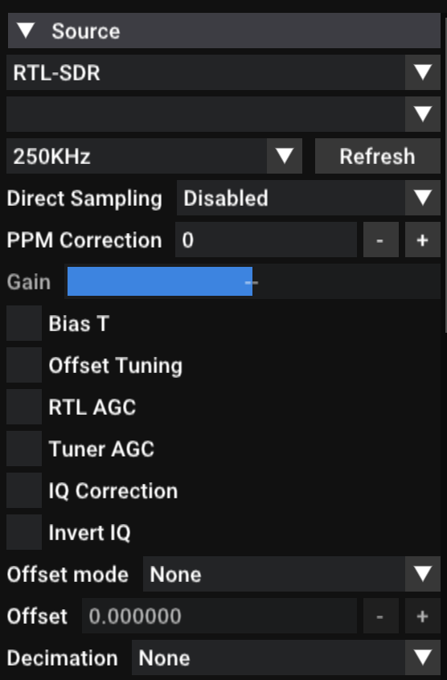
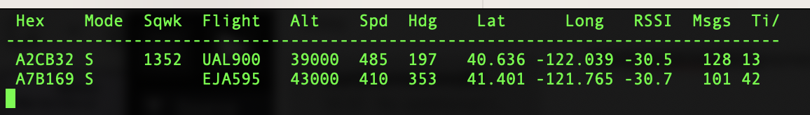

# International Space University SETI Workshop

## 1. Introduction

Welcome to the ISU SETI workshop for 2024! In this workshop we are going to explore our local radio environment with the aim of understanding how we use radio waves to communicate, and how that both motivates and presents challenges 

### The Local Radio Environment

#### FM Radio

The frequency modulation (FM) radio band is between 88 MHz and 108 MHz. The signals you find in this band have encoded within them nearby radio station transmissions.

#### Aircraft Telemetry (ADS-B: Automatic Dependent Surveillance–Broadcast)

Ocurring at 1090 MHz, these transmissions include important safety information from aircraft, including their position, identification, and bearing. This information is automatically broadcast by all aircraft and assists with situational awareness. Also used for communications from e.g. fire departments, police, etc. This data is used by websites such as [Flightradar24](https://www.flightradar24.com/) to provide tracking information to the general public.

## 2. Hardware

### Nooelec NESDR

The [Nooelec NESDR](https://www.nooelec.com/store/sdr/sdr-receivers/nesdr-mini-plus.html) gives us the ability to receiver radio signals from the local area. Examples of such signals are FM radio, aircraft information, and  amateur radio broadcasts. This is an example of a Software Defined Radio (SDR), so called as the actual data processing is carried out on our laptops and the receiver itself just detects and digitises the radio data.

The receiver is sensitive to radio signals in the 25 MHz to 1750 MHz range (corresponding to wavelengths between 12 meters and 17 centimeters).

## 3. Software

### SDR++

In order to utilise the power of the Software Defined Radio (SDR) we need to install some software. The first of these is [SDR++](https://www.sdrpp.org/), which is a lightweight way of interacting with the antenna that we have attached to out laptops. Installation should be fairly simple on all platforms (Windows, MacOS, Linux) and full details can be found [here](https://www.sdrpp.org/manual.pdf). This software will give a clear view of what signals are being detected by the SDR, and at which frequency they are found at. To install this software click the "Download Latest Nightly Build" button and select the version corresponding to the make of your laptop.

See below for an overview of the different important parts of the SDR++ interface.

*The "Source" panel of SDR++ allowing your to select the receiver (yours should be detected automatically), change the bandwidth you're sensntive to, and select a number of options related to gain control.*

*Along the top of SDR++ you will see where your radio is currently tuned, in thise case 90.17 MHz. Clicking on the top or bottom of each number allows your to change and finely tune the radio frequency.*

### Homebrew (MacOS only!)

[Brew](https://brew.sh/) is a package manager from MacOS which allows you to easily install other pieces of software (such as Dump1090 and GNU radio, see below). On MacOS install brew by running `/bin/bash -c "$(curl -fsSL https://raw.githubusercontent.com/Homebrew/install/HEAD/install.sh)` in your terminal. Windows users should ignore this step.

### Dump1090

To install Dump1090 either:

1. If you are running a MacOS system and you have installed homebrew you can easily install Dump1090 using the command `brew install dump1090-mutability` in your terminal.

2. On Windows...

*This simple terminal output shows the Dump1090 software decoding ADS-B data from aircraft over northern California, USA.*

### GNU Radio

To install GNU radio either:

1. If you are running a MacOS system and you have installed homebrew you can run `brew install gnuradio` in your terminal.

## 4. Workshop Projects

Here are some things you should try and attempt in this workshop, in order of difficulty. The final part of the workshop will be a group observation made from an international class radio facility; The Allen Telescope Array.

### 4.1 Use SDR++ to find local FM radio signals

Open up SDR++ with your SDR plugged into your laptop.

### 4.2 Use Dump1090 to track local aircraft

The software Dump1090 can be used to track local aircraft ... PUT TOGETHER A LINK TO A JUPYTER NOTEBOOK WHERE PEOPLE CAN ADD IN INFORMATION FROM AIRCRAFT AND THEIR POSITIONS ETC.

Try running `dump1090 --interactive` and interpret the information output in your terminal. Make a copy of the jupyter notebook found [here](https://colab.research.google.com/drive/116FjxkFM0DM4YF40ccY2Rg2osWVKWxAD?usp=sharing) and input the information from dump1090 into the indicated region in the notebook. Try plotting your results and match these to e.g. [Flightradar24](https://www.flightradar24.com/). 

### 4.3 Create a simple FM decoder in GNU Radio

The software we've been using already (SDR++ and Dump1090) provides a simple way for a user to interface with their SDR. In the process it is doing the complicated work of decoding (the process of obtaining useful information from the signal) for us. Using GNU Radio we can directly interface with the raw digital signal recevied by our SDR and manipulate it ourselves to try and tease out useful information.

The FM in FM radio stands for Frequency Modulation, and this modulation is how the signal carries information.

### 4.4 Observe a celestial body with the Allen Telescope Array 

